# 📋 Phân Tích Chức Năng Hệ Thống DB Cloud

## 1. 🗺️ Tổng Quan Các Chức Năng (Feature Overview)

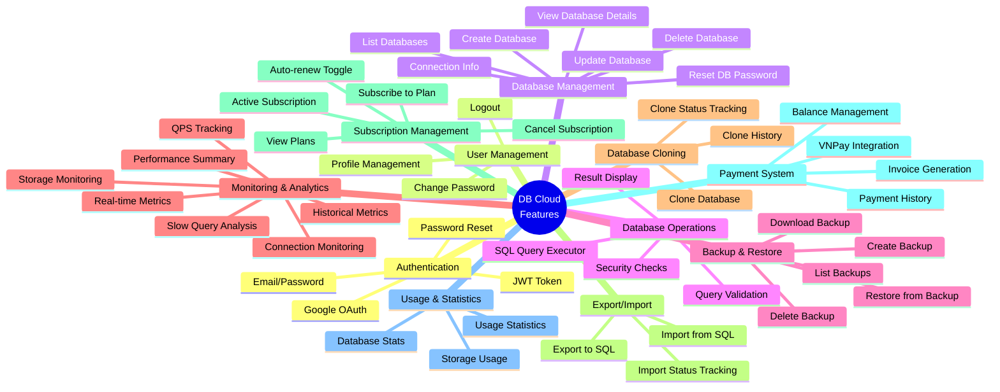

## 2. 🎯 Phân Loại Chức Năng Theo Module

```mermaid
graph TB
    subgraph "🔐 Authentication Module"
        A1[Email/Password Login]
        A2[Google OAuth Login]
        A3[User Registration]
        A4[Password Reset]
        A5[JWT Token Management]
    end

    subgraph "👤 User Management Module"
        U1[View Profile]
        U2[Update Profile]
        U3[Change Password]
        U4[View Balance/Points]
    end

    subgraph "🗄️ Database Core Module"
        D1[Create Database]
        D2[List Databases]
        D3[View Database Details]
        D4[Update Database Info]
        D5[Delete Database]
        D6[Connection Information]
        D7[Reset DB Password]
    end

    subgraph "💻 SQL Operations Module"
        S1[Execute SQL Query]
        S2[Query Validation]
        S3[Security Checks]
        S4[Result Formatting]
        S5[Error Handling]
        S6[Warning Detection]
    end

    subgraph "💾 Backup & Restore Module"
        B1[Create Backup]
        B2[List Backups]
        B3[Download Backup]
        B4[Delete Backup]
        B5[Restore Database]
        B6[Backup Status Tracking]
    end

    subgraph "📊 Monitoring Module"
        M1[Real-time Metrics]
        M2[Historical Metrics]
        M3[QPS Calculation]
        M4[Connection Monitoring]
        M5[Storage Tracking]
        M6[Performance Summary]
        M7[Slow Query Detection]
    end

    subgraph "📋 Clone Module"
        C1[Clone Database]
        C2[Clone Status]
        C3[Clone History]
    end

    subgraph "📤 Export/Import Module"
        E1[Export to SQL File]
        E2[Import from SQL File]
        E3[Import Status]
        E4[Import History]
    end

    subgraph "💳 Subscription Module"
        SUB1[View Pricing Plans]
        SUB2[Subscribe to Plan]
        SUB3[Cancel Subscription]
        SUB4[Auto-renew Toggle]
        SUB5[Active Subscription Info]
    end

    subgraph "💰 Payment Module"
        P1[VNPay Payment]
        P2[Payment History]
        P3[Balance Top-up]
        P4[Invoice Generation]
    end

    subgraph "📈 Usage & Analytics Module"
        UA1[Storage Usage Stats]
        UA2[Database Statistics]
        UA3[Usage Reports]
    end

    style A1 fill:#e1f5ff
    style D1 fill:#61dafb
    style S1 fill:#4479a1
    style B1 fill:#ff9800
    style M1 fill:#009688
```

## 3. 🔗 Mối Quan Hệ Giữa Các Chức Năng (Feature Dependencies)

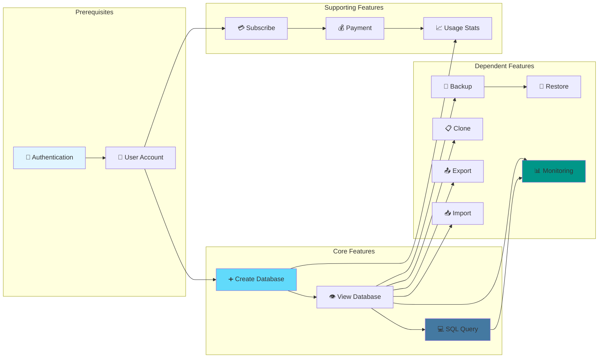

## 4. 👣 User Journey Map - Luồng Người Dùng

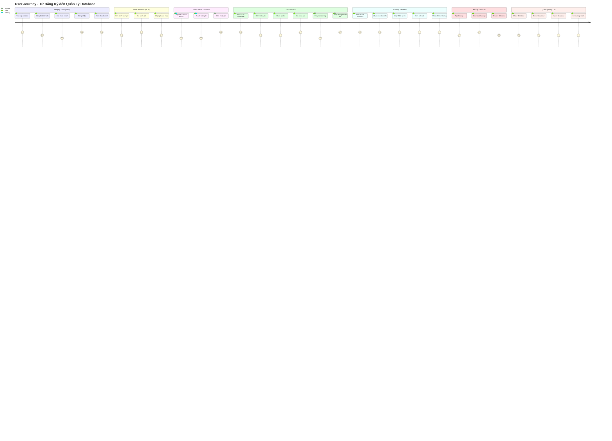

## 5. 🎨 Chi Tiết Chức Năng - Database Management

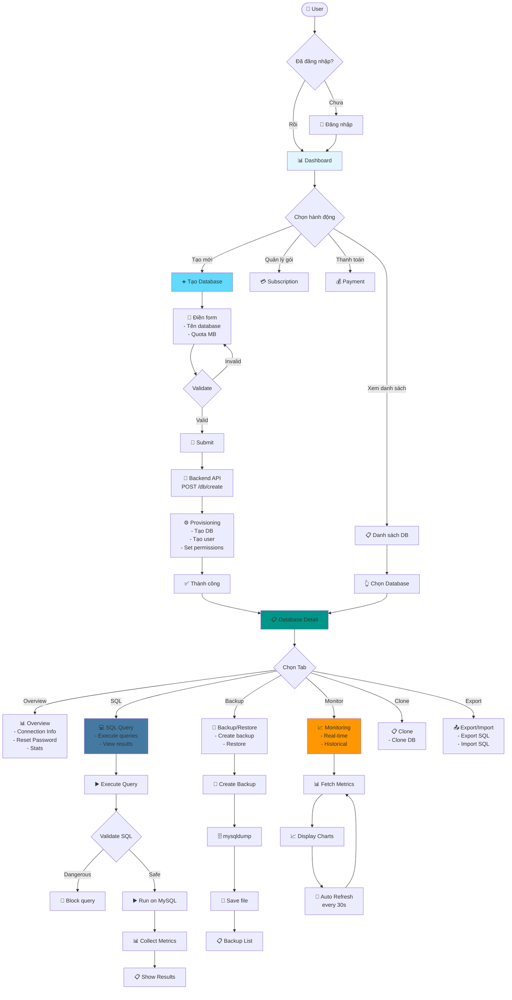

## 6. 🔄 Luồng Tương Tác Giữa Các Chức Năng

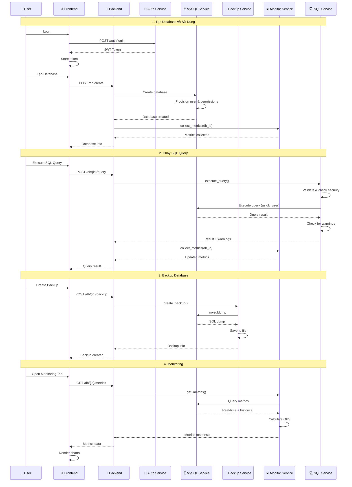

## 7. 📊 Feature Matrix - Ma Trận Chức Năng

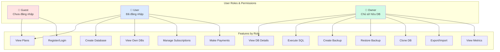

## 8. 🎯 Feature Priority & Status Matrix

```mermaid
quadrantChart
    title Feature Priority Matrix
    x-axis Low Priority --> High Priority
    y-axis Low Complexity --> High Complexity
    quadrant-1 Nice to Have
    quadrant-2 Quick Wins
    quadrant-3 Major Projects
    quadrant-4 Strategic Initiatives
    Login: [0.8, 0.2]
    Register: [0.8, 0.2]
    Create DB: [0.9, 0.6]
    SQL Query: [1.0, 0.7]
    Backup: [0.95, 0.5]
    Restore: [0.95, 0.5]
    Monitoring: [0.9, 0.8]
    Clone: [0.7, 0.6]
    Export/Import: [0.75, 0.65]
    Payments: [0.85, 0.7]
    Subscriptions: [0.8, 0.6]
    Google OAuth: [0.6, 0.4]
    Slow Query Analysis: [0.7, 0.7]
    Usage Stats: [0.65, 0.5]
```

## 9. 🔐 Security Features & Validations

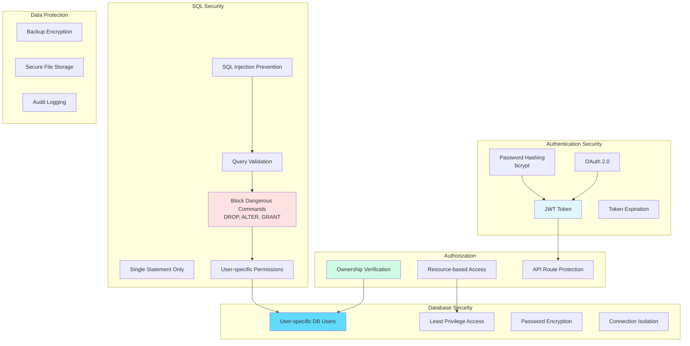

## 10. 📈 Monitoring & Analytics Features

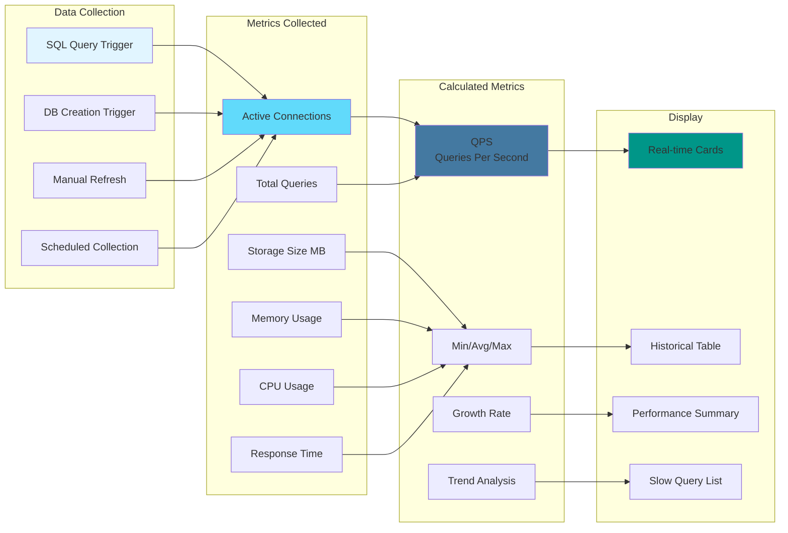

## 11. 💳 Payment & Subscription Flow

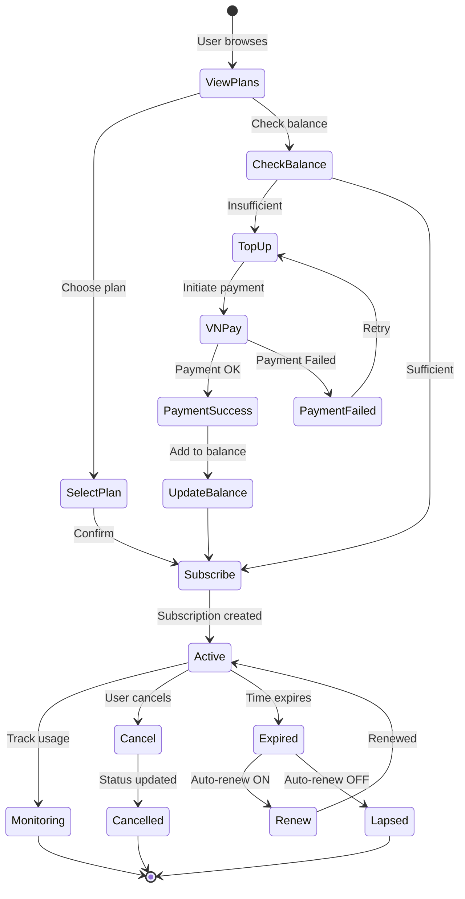

## 12. 🗄️ Database Lifecycle Management

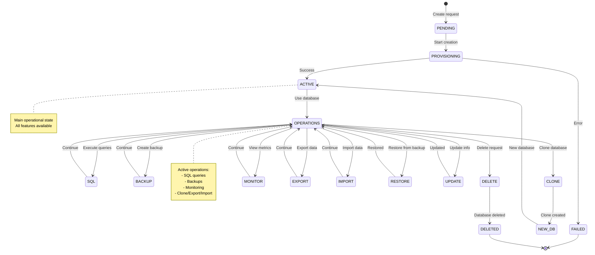

## 13. 🔄 Feature Integration Points

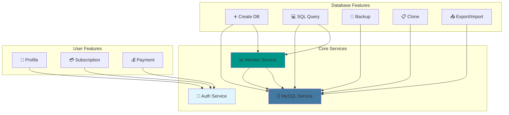

## 14. 📱 API Endpoints by Feature Group

```mermaid
mindmap
  root((API Endpoints))
    Authentication
      POST /auth/register
      POST /auth/login
      GET /auth/google
      POST /auth/google/callback
    User Management
      GET /me
      PUT /me
      POST /me/change-password
    Database CRUD
      POST /db/create
      GET /db/list
      GET /db/{id}
      PUT /db/{id}
      DELETE /db/{id}
      GET /db/{id}/stats
      GET /db/{id}/connection
      POST /db/{id}/reset-password
    SQL Operations
      POST /db/{id}/query
    Backup & Restore
      POST /db/{id}/backup
      GET /db/{id}/backups
      GET /db/{id}/backups/{id}
      DELETE /db/{id}/backups/{id}
      GET /db/{id}/backups/{id}/download
      POST /db/{id}/restore
      GET /db/{id}/restores
      GET /db/{id}/restores/{id}
    Monitoring
      GET /db/{id}/metrics
      GET /db/{id}/metrics/realtime
      GET /db/{id}/connections
      GET /db/{id}/slow-queries
      GET /db/{id}/performance
    Clone
      POST /db/{id}/clone
      GET /db/{id}/clones
      GET /clones/{id}
    Export/Import
      GET /db/{id}/export
      POST /db/{id}/import
      GET /db/{id}/imports
      GET /imports/{id}
    Subscription
      GET /plans
      GET /subscriptions
      POST /subscriptions
      POST /subscriptions/{id}/cancel
      POST /subscriptions/{id}/auto-renew
      GET /subscriptions/active
    Payment
      POST /payments/create
      GET /payments/vnpay/callback
      GET /invoices
    Usage & Stats
      GET /subscription/storage-info
      GET /usage/stats
```

## 15. 🎯 Feature Success Metrics

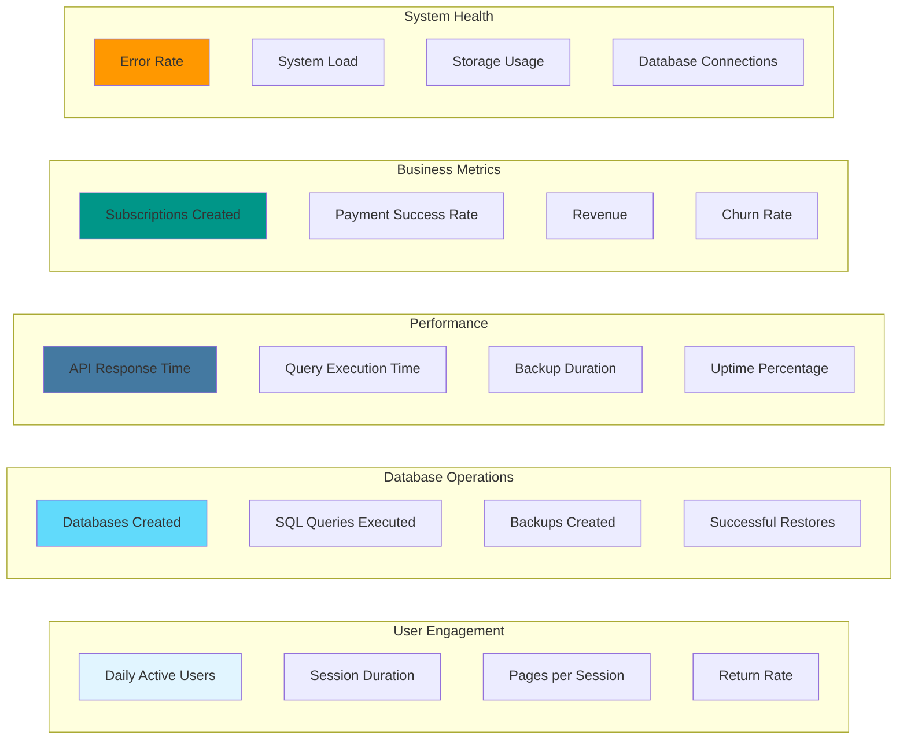

## 16. 🚀 Feature Roadmap & Evolution

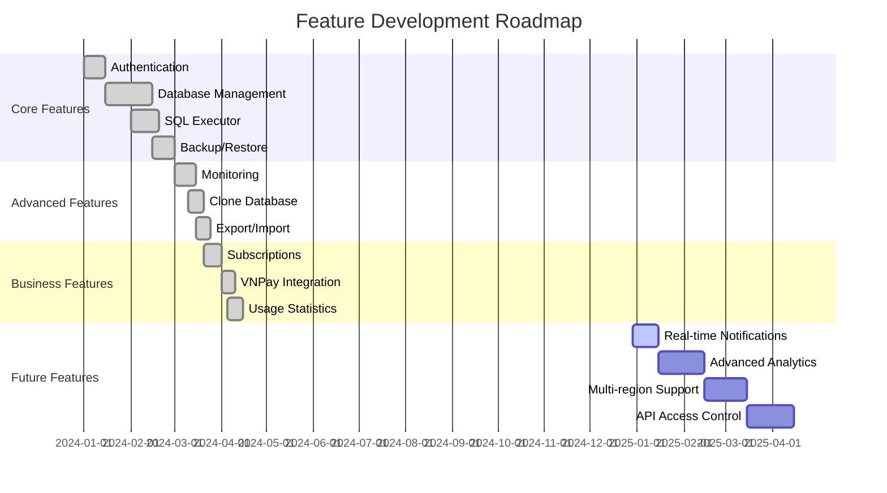

## 17. 🔍 Feature Testing Coverage

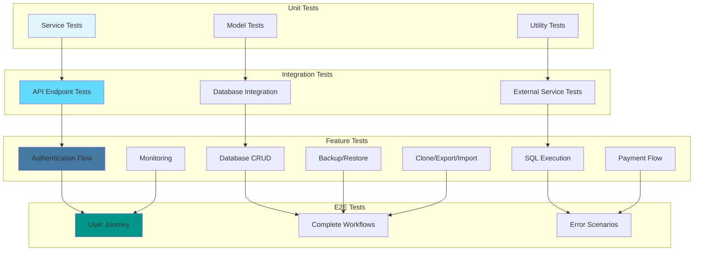

## 18. 📊 Feature Usage Analytics

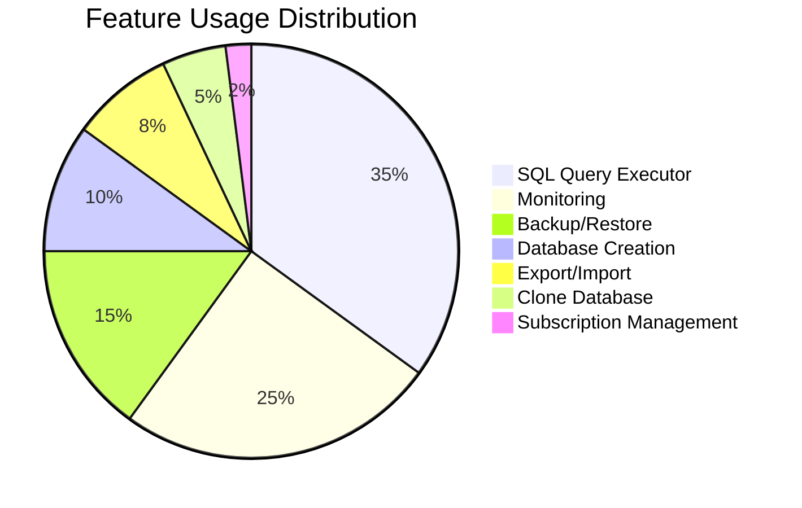

## 19. 🎨 UI/UX Feature Breakdown

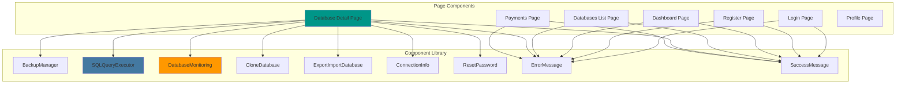

## 20. 🔄 Data Flow Between Features

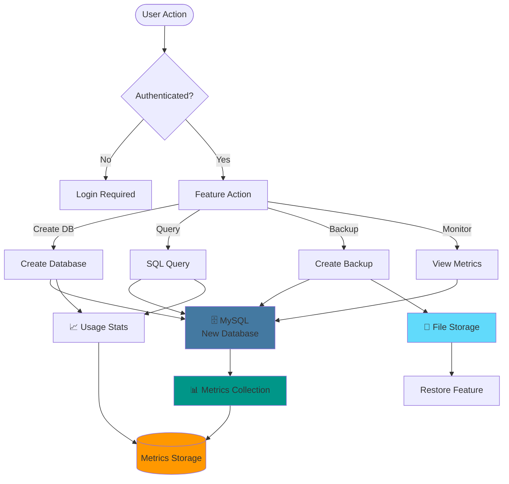

---

## 📝 Tóm Tắt

### Core Features (Tính năng cốt lõi)
1. **Authentication & Authorization** - Đăng nhập, đăng ký, xác thực
2. **Database Management** - Tạo, xóa, quản lý database
3. **SQL Query Execution** - Thực thi và quản lý SQL queries
4. **Backup & Restore** - Sao lưu và khôi phục database
5. **Monitoring & Analytics** - Giám sát hiệu suất và phân tích

### Advanced Features (Tính năng nâng cao)
6. **Database Cloning** - Sao chép database
7. **Export/Import** - Xuất/nhập SQL files
8. **Subscription Management** - Quản lý gói dịch vụ
9. **Payment Integration** - Tích hợp thanh toán VNPay
10. **Usage Statistics** - Thống kê sử dụng

### Security Features (Tính năng bảo mật)
- JWT-based authentication
- User-specific database users
- SQL injection prevention
- Query validation & filtering
- Ownership verification
- Secure password handling

### Monitoring Features (Tính năng giám sát)
- Real-time metrics (Connections, Storage, QPS)
- Historical metrics với min/avg/max
- Performance summary
- Slow query detection
- Auto-refresh capabilities

Tất cả các tính năng được tích hợp chặt chẽ và hỗ trợ lẫn nhau để tạo ra một hệ thống quản lý database cloud hoàn chỉnh.

