# 📊 Hệ Thống DB Cloud - Sơ Đồ Kiến Trúc & Luồng Hoạt Động

## 1. 🏗️ Kiến Trúc Hệ Thống Tổng Quan

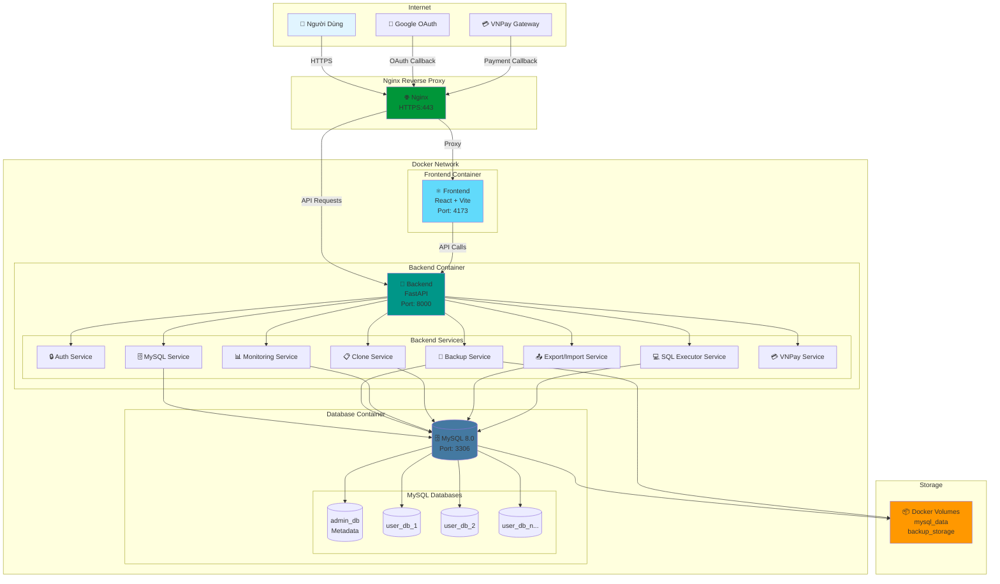
```mermaid
graph TB
    subgraph "Internet"
        User[👤 Người Dùng]
        Google[🔐 Google OAuth]
        VNPay[💳 VNPay Gateway]
    end

    subgraph "Nginx Reverse Proxy"
        Nginx[🌐 Nginx<br/>HTTPS:443]
    end

    subgraph "Docker Network"
        subgraph "Frontend Container"
            FE[⚛️ Frontend<br/>React + Vite<br/>Port: 4173]
        end

        subgraph "Backend Container"
            BE[🐍 Backend<br/>FastAPI<br/>Port: 8000]
            
            subgraph "Backend Services"
                AuthService[🔒 Auth Service]
                DBService[🗄️ MySQL Service]
                BackupService[💾 Backup Service]
                MonitorService[📊 Monitoring Service]
                CloneService[📋 Clone Service]
                ExportService[📤 Export/Import Service]
                SQLService[💻 SQL Executor Service]
                VNPayService[💳 VNPay Service]
            end
        end

        subgraph "Database Container"
            MySQL[(🗄️ MySQL 8.0<br/>Port: 3306)]
            
            subgraph "MySQL Databases"
                AdminDB[(admin_db<br/>Metadata)]
                UserDB1[(user_db_1)]
                UserDB2[(user_db_2)]
                UserDBN[(user_db_n...)]
            end
        end
    end

    subgraph "Storage"
        Volumes[📦 Docker Volumes<br/>mysql_data<br/>backup_storage]
    end

    User -->|HTTPS| Nginx
    Google -->|OAuth Callback| Nginx
    VNPay -->|Payment Callback| Nginx
    
    Nginx -->|Proxy| FE
    Nginx -->|API Requests| BE
    
    FE -->|API Calls| BE
    
    BE --> AuthService
    BE --> DBService
    BE --> BackupService
    BE --> MonitorService
    BE --> CloneService
    BE --> ExportService
    BE --> SQLService
    BE --> VNPayService
    
    DBService --> MySQL
    BackupService --> MySQL
    MonitorService --> MySQL
    CloneService --> MySQL
    ExportService --> MySQL
    SQLService --> MySQL
    
    MySQL --> AdminDB
    MySQL --> UserDB1
    MySQL --> UserDB2
    MySQL --> UserDBN
    
    BackupService --> Volumes
    MySQL --> Volumes

    style User fill:#e1f5ff
    style FE fill:#61dafb
    style BE fill:#009688
    style MySQL fill:#4479a1
    style Volumes fill:#ff9800
    style Nginx fill:#009639
```

## 2. 🔐 Luồng Đăng Ký & Đăng Nhập

### 2.1. Đăng Ký với Email/Password

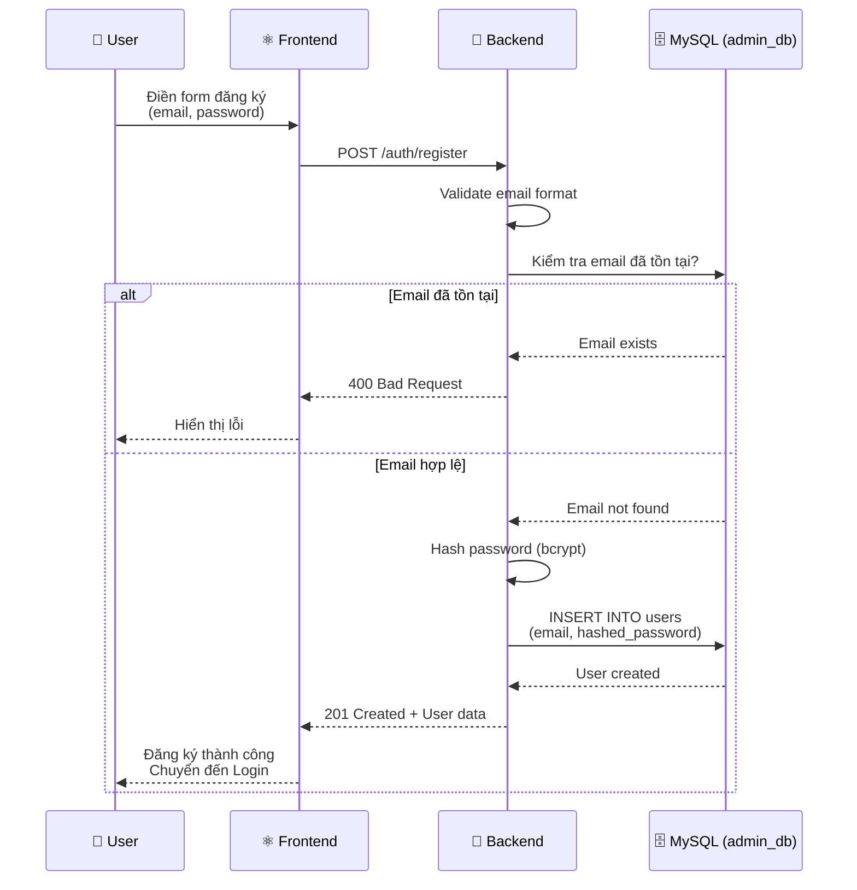
```mermaid
sequenceDiagram
    participant U as 👤 User
    participant FE as ⚛️ Frontend
    participant BE as 🐍 Backend
    participant DB as 🗄️ MySQL (admin_db)

    U->>FE: Điền form đăng ký<br/>(email, password)
    FE->>BE: POST /auth/register
    BE->>BE: Validate email format
    BE->>DB: Kiểm tra email đã tồn tại?
    alt Email đã tồn tại
        DB-->>BE: Email exists
        BE-->>FE: 400 Bad Request
        FE-->>U: Hiển thị lỗi
    else Email hợp lệ
        DB-->>BE: Email not found
        BE->>BE: Hash password (bcrypt)
        BE->>DB: INSERT INTO users<br/>(email, hashed_password)
        DB-->>BE: User created
        BE-->>FE: 201 Created + User data
        FE-->>U: Đăng ký thành công<br/>Chuyển đến Login
    end
```

### 2.2. Đăng Nhập với Google OAuth

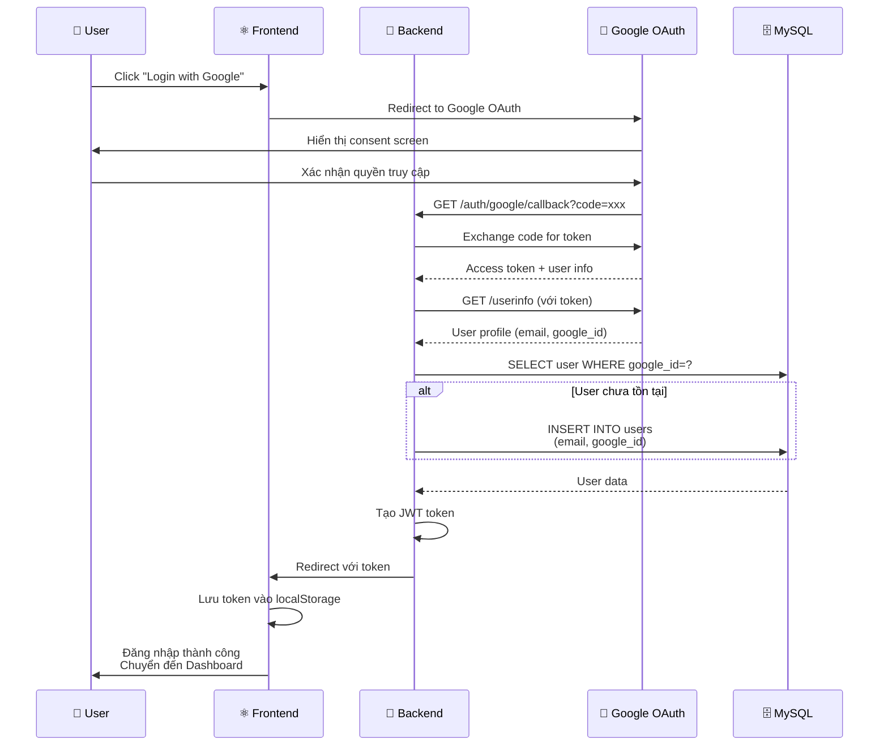
```mermaid
sequenceDiagram
    participant U as 👤 User
    participant FE as ⚛️ Frontend
    participant BE as 🐍 Backend
    participant Google as 🔐 Google OAuth
    participant DB as 🗄️ MySQL

    U->>FE: Click "Login with Google"
    FE->>Google: Redirect to Google OAuth
    Google->>U: Hiển thị consent screen
    U->>Google: Xác nhận quyền truy cập
    Google->>BE: GET /auth/google/callback?code=xxx
    BE->>Google: Exchange code for token
    Google-->>BE: Access token + user info
    BE->>Google: GET /userinfo (với token)
    Google-->>BE: User profile (email, google_id)
    BE->>DB: SELECT user WHERE google_id=?
    alt User chưa tồn tại
        BE->>DB: INSERT INTO users<br/>(email, google_id)
    end
    DB-->>BE: User data
    BE->>BE: Tạo JWT token
    BE->>FE: Redirect với token
    FE->>FE: Lưu token vào localStorage
    FE->>U: Đăng nhập thành công<br/>Chuyển đến Dashboard
```

### 2.3. Đăng Nhập với Email/Password

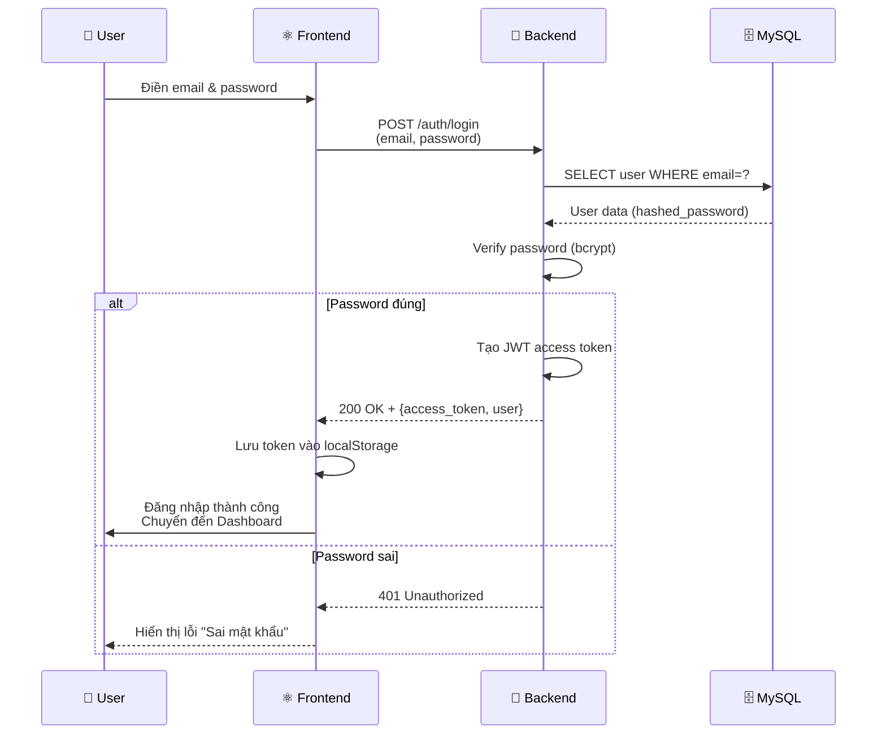
```mermaid
sequenceDiagram
    participant U as 👤 User
    participant FE as ⚛️ Frontend
    participant BE as 🐍 Backend
    participant DB as 🗄️ MySQL

    U->>FE: Điền email & password
    FE->>BE: POST /auth/login<br/>(email, password)
    BE->>DB: SELECT user WHERE email=?
    DB-->>BE: User data (hashed_password)
    BE->>BE: Verify password (bcrypt)
    alt Password đúng
        BE->>BE: Tạo JWT access token
        BE-->>FE: 200 OK + {access_token, user}
        FE->>FE: Lưu token vào localStorage
        FE->>U: Đăng nhập thành công<br/>Chuyển đến Dashboard
    else Password sai
        BE-->>FE: 401 Unauthorized
        FE-->>U: Hiển thị lỗi "Sai mật khẩu"
    end
```

## 3. 🗄️ Luồng Tạo Database

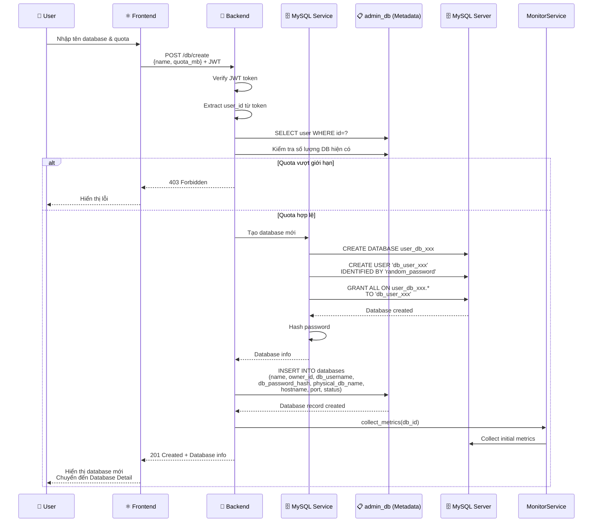
```mermaid
sequenceDiagram
    participant U as 👤 User
    participant FE as ⚛️ Frontend
    participant BE as 🐍 Backend
    participant MySQLService as 🗄️ MySQL Service
    participant AdminDB as 📋 admin_db (Metadata)
    participant MySQL as 🗄️ MySQL Server

    U->>FE: Nhập tên database & quota
    FE->>BE: POST /db/create<br/>{name, quota_mb} + JWT
    BE->>BE: Verify JWT token
    BE->>BE: Extract user_id từ token
    BE->>AdminDB: SELECT user WHERE id=?
    BE->>AdminDB: Kiểm tra số lượng DB hiện có
    alt Quota vượt giới hạn
        BE-->>FE: 403 Forbidden
        FE-->>U: Hiển thị lỗi
    else Quota hợp lệ
        BE->>MySQLService: Tạo database mới
        MySQLService->>MySQL: CREATE DATABASE user_db_xxx
        MySQLService->>MySQL: CREATE USER 'db_user_xxx'<br/>IDENTIFIED BY 'random_password'
        MySQLService->>MySQL: GRANT ALL ON user_db_xxx.*<br/>TO 'db_user_xxx'
        MySQL-->>MySQLService: Database created
        MySQLService->>MySQLService: Hash password
        MySQLService-->>BE: Database info
        BE->>AdminDB: INSERT INTO databases<br/>(name, owner_id, db_username,<br/>db_password_hash, physical_db_name,<br/>hostname, port, status)
        AdminDB-->>BE: Database record created
        BE->>MonitorService: collect_metrics(db_id)
        MonitorService->>MySQL: Collect initial metrics
        BE-->>FE: 201 Created + Database info
        FE-->>U: Hiển thị database mới<br/>Chuyển đến Database Detail
    end
```

## 4. 💻 Luồng Thực Thi SQL Query

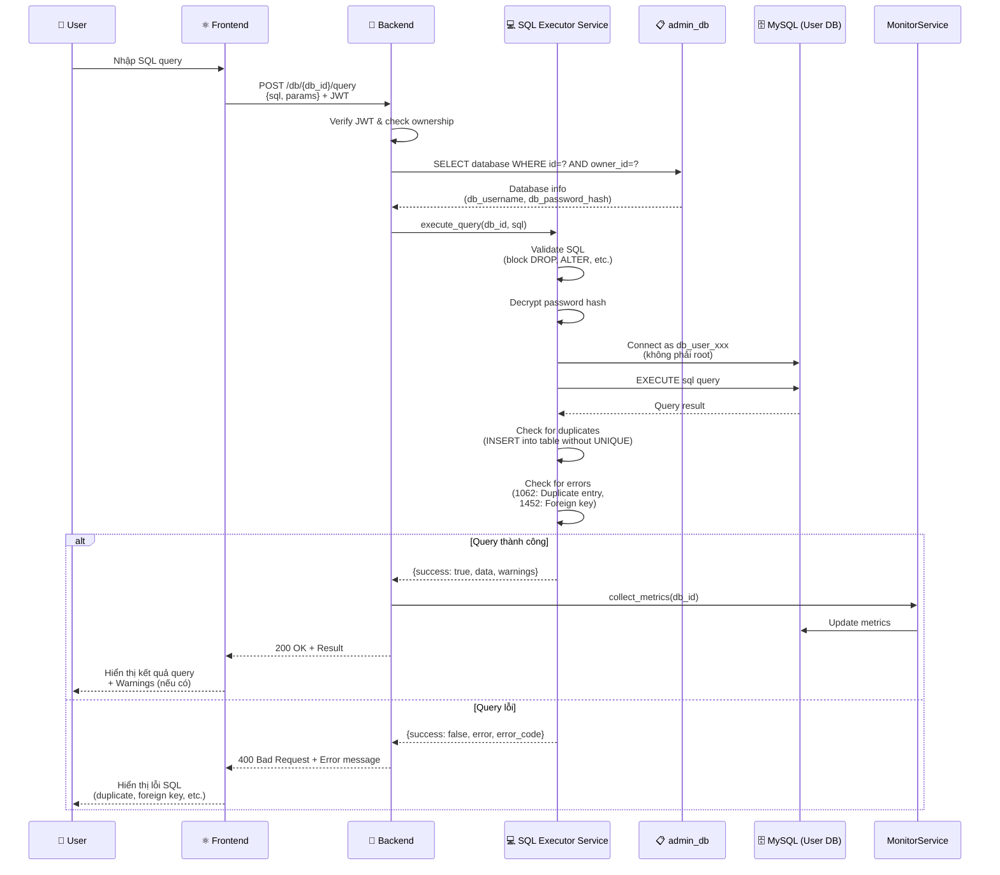
```mermaid
sequenceDiagram
    participant U as 👤 User
    participant FE as ⚛️ Frontend
    participant BE as 🐍 Backend
    participant SQLService as 💻 SQL Executor Service
    participant AdminDB as 📋 admin_db
    participant MySQL as 🗄️ MySQL (User DB)

    U->>FE: Nhập SQL query
    FE->>BE: POST /db/{db_id}/query<br/>{sql, params} + JWT
    BE->>BE: Verify JWT & check ownership
    BE->>AdminDB: SELECT database WHERE id=? AND owner_id=?
    AdminDB-->>BE: Database info<br/>(db_username, db_password_hash)
    BE->>SQLService: execute_query(db_id, sql)
    SQLService->>SQLService: Validate SQL<br/>(block DROP, ALTER, etc.)
    SQLService->>SQLService: Decrypt password hash
    SQLService->>MySQL: Connect as db_user_xxx<br/>(không phải root)
    SQLService->>MySQL: EXECUTE sql query
    MySQL-->>SQLService: Query result
    SQLService->>SQLService: Check for duplicates<br/>(INSERT into table without UNIQUE)
    SQLService->>SQLService: Check for errors<br/>(1062: Duplicate entry,<br/>1452: Foreign key)
    alt Query thành công
        SQLService-->>BE: {success: true, data, warnings}
        BE->>MonitorService: collect_metrics(db_id)
        MonitorService->>MySQL: Update metrics
        BE-->>FE: 200 OK + Result
        FE-->>U: Hiển thị kết quả query<br/>+ Warnings (nếu có)
    else Query lỗi
        SQLService-->>BE: {success: false, error, error_code}
        BE-->>FE: 400 Bad Request + Error message
        FE-->>U: Hiển thị lỗi SQL<br/>(duplicate, foreign key, etc.)
    end
```

## 5. 📊 Luồng Monitoring & Thu Thập Metrics

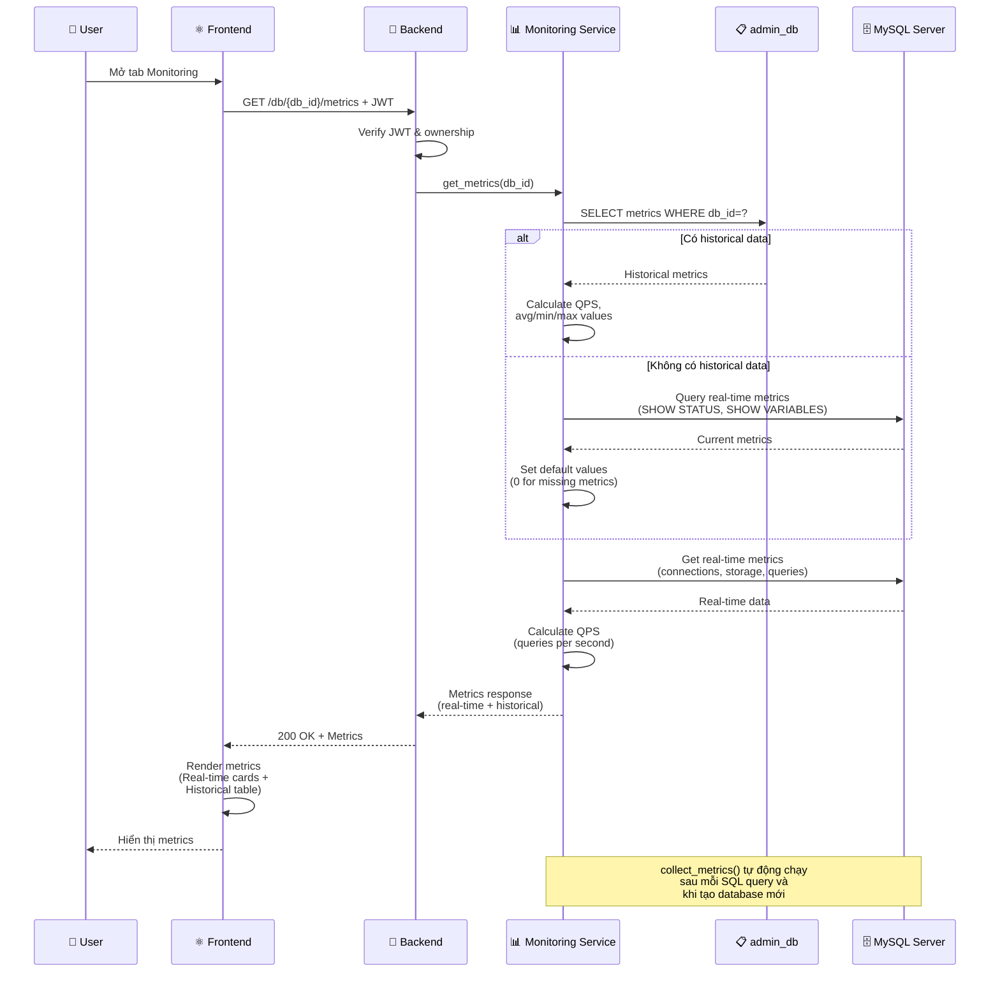
```mermaid
sequenceDiagram
    participant U as 👤 User
    participant FE as ⚛️ Frontend
    participant BE as 🐍 Backend
    participant MonitorService as 📊 Monitoring Service
    participant AdminDB as 📋 admin_db
    participant MySQL as 🗄️ MySQL Server

    U->>FE: Mở tab Monitoring
    FE->>BE: GET /db/{db_id}/metrics + JWT
    BE->>BE: Verify JWT & ownership
    BE->>MonitorService: get_metrics(db_id)
    MonitorService->>AdminDB: SELECT metrics WHERE db_id=?
    
    alt Có historical data
        AdminDB-->>MonitorService: Historical metrics
        MonitorService->>MonitorService: Calculate QPS,<br/>avg/min/max values
    else Không có historical data
        MonitorService->>MySQL: Query real-time metrics<br/>(SHOW STATUS, SHOW VARIABLES)
        MySQL-->>MonitorService: Current metrics
        MonitorService->>MonitorService: Set default values<br/>(0 for missing metrics)
    end
    
    MonitorService->>MySQL: Get real-time metrics<br/>(connections, storage, queries)
    MySQL-->>MonitorService: Real-time data
    MonitorService->>MonitorService: Calculate QPS<br/>(queries per second)
    MonitorService-->>BE: Metrics response<br/>(real-time + historical)
    BE-->>FE: 200 OK + Metrics
    FE->>FE: Render metrics<br/>(Real-time cards +<br/>Historical table)
    FE-->>U: Hiển thị metrics

    Note over MonitorService,MySQL: collect_metrics() tự động chạy<br/>sau mỗi SQL query và<br/>khi tạo database mới
```

## 6. 💾 Luồng Backup & Restore

### 6.1. Tạo Backup

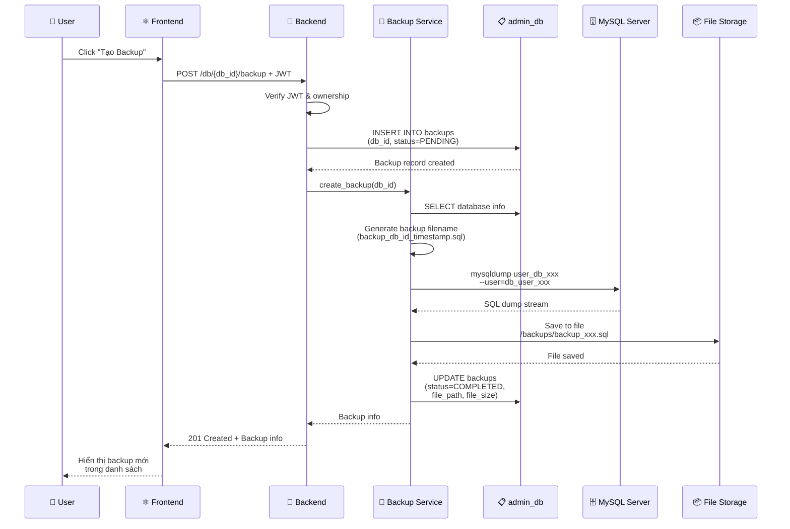
```mermaid
sequenceDiagram
    participant U as 👤 User
    participant FE as ⚛️ Frontend
    participant BE as 🐍 Backend
    participant BackupService as 💾 Backup Service
    participant AdminDB as 📋 admin_db
    participant MySQL as 🗄️ MySQL Server
    participant Storage as 📦 File Storage

    U->>FE: Click "Tạo Backup"
    FE->>BE: POST /db/{db_id}/backup + JWT
    BE->>BE: Verify JWT & ownership
    BE->>AdminDB: INSERT INTO backups<br/>(db_id, status=PENDING)
    AdminDB-->>BE: Backup record created
    BE->>BackupService: create_backup(db_id)
    BackupService->>AdminDB: SELECT database info
    BackupService->>BackupService: Generate backup filename<br/>(backup_db_id_timestamp.sql)
    BackupService->>MySQL: mysqldump user_db_xxx<br/>--user=db_user_xxx
    MySQL-->>BackupService: SQL dump stream
    BackupService->>Storage: Save to file<br/>/backups/backup_xxx.sql
    Storage-->>BackupService: File saved
    BackupService->>AdminDB: UPDATE backups<br/>(status=COMPLETED,<br/>file_path, file_size)
    BackupService-->>BE: Backup info
    BE-->>FE: 201 Created + Backup info
    FE-->>U: Hiển thị backup mới<br/>trong danh sách
```

### 6.2. Restore từ Backup

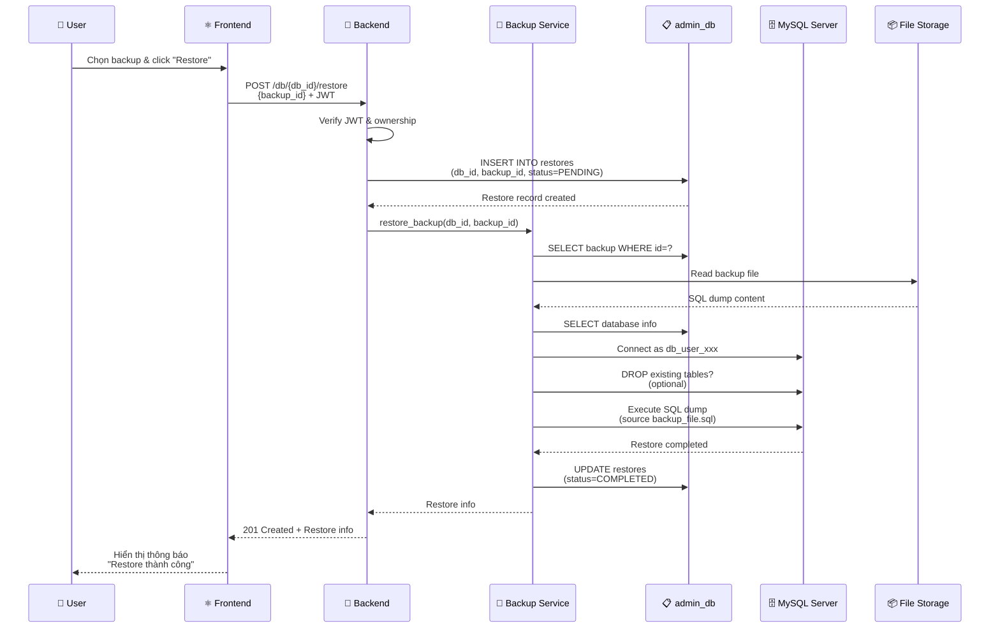
```mermaid
sequenceDiagram
    participant U as 👤 User
    participant FE as ⚛️ Frontend
    participant BE as 🐍 Backend
    participant BackupService as 💾 Backup Service
    participant AdminDB as 📋 admin_db
    participant MySQL as 🗄️ MySQL Server
    participant Storage as 📦 File Storage

    U->>FE: Chọn backup & click "Restore"
    FE->>BE: POST /db/{db_id}/restore<br/>{backup_id} + JWT
    BE->>BE: Verify JWT & ownership
    BE->>AdminDB: INSERT INTO restores<br/>(db_id, backup_id, status=PENDING)
    AdminDB-->>BE: Restore record created
    BE->>BackupService: restore_backup(db_id, backup_id)
    BackupService->>AdminDB: SELECT backup WHERE id=?
    BackupService->>Storage: Read backup file
    Storage-->>BackupService: SQL dump content
    BackupService->>AdminDB: SELECT database info
    BackupService->>MySQL: Connect as db_user_xxx
    BackupService->>MySQL: DROP existing tables?<br/>(optional)
    BackupService->>MySQL: Execute SQL dump<br/>(source backup_file.sql)
    MySQL-->>BackupService: Restore completed
    BackupService->>AdminDB: UPDATE restores<br/>(status=COMPLETED)
    BackupService-->>BE: Restore info
    BE-->>FE: 201 Created + Restore info
    FE-->>U: Hiển thị thông báo<br/>"Restore thành công"
```

## 7. 📋 Luồng Clone Database

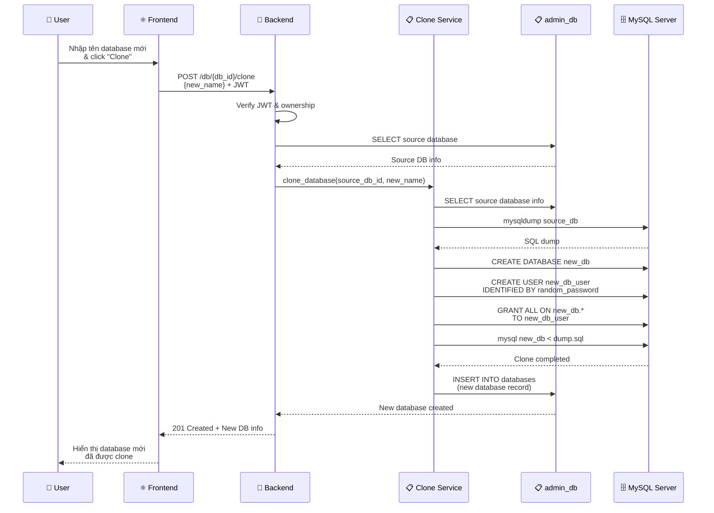
```mermaid
sequenceDiagram
    participant U as 👤 User
    participant FE as ⚛️ Frontend
    participant BE as 🐍 Backend
    participant CloneService as 📋 Clone Service
    participant AdminDB as 📋 admin_db
    participant MySQL as 🗄️ MySQL Server

    U->>FE: Nhập tên database mới<br/>& click "Clone"
    FE->>BE: POST /db/{db_id}/clone<br/>{new_name} + JWT
    BE->>BE: Verify JWT & ownership
    BE->>AdminDB: SELECT source database
    AdminDB-->>BE: Source DB info
    BE->>CloneService: clone_database(source_db_id, new_name)
    CloneService->>AdminDB: SELECT source database info
    CloneService->>MySQL: mysqldump source_db
    MySQL-->>CloneService: SQL dump
    CloneService->>MySQL: CREATE DATABASE new_db
    CloneService->>MySQL: CREATE USER new_db_user<br/>IDENTIFIED BY random_password
    CloneService->>MySQL: GRANT ALL ON new_db.*<br/>TO new_db_user
    CloneService->>MySQL: mysql new_db < dump.sql
    MySQL-->>CloneService: Clone completed
    CloneService->>AdminDB: INSERT INTO databases<br/>(new database record)
    AdminDB-->>BE: New database created
    BE-->>FE: 201 Created + New DB info
    FE-->>U: Hiển thị database mới<br/>đã được clone
```

## 8. 💳 Luồng Thanh Toán VNPay

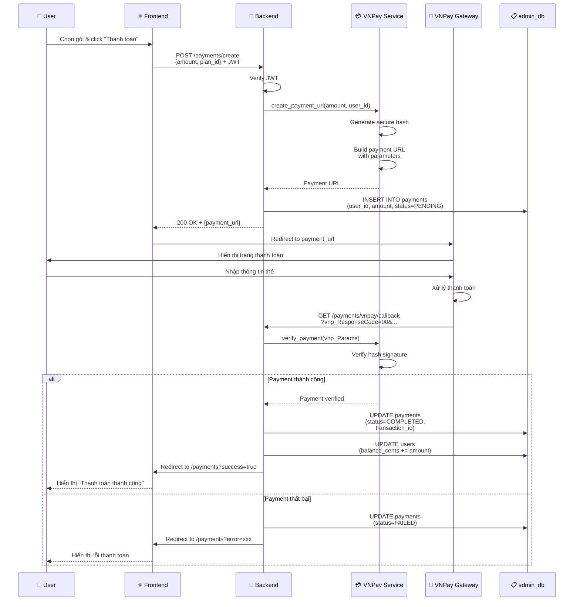
```mermaid
sequenceDiagram
    participant U as 👤 User
    participant FE as ⚛️ Frontend
    participant BE as 🐍 Backend
    participant VNPayService as 💳 VNPay Service
    participant VNPay as 🏦 VNPay Gateway
    participant AdminDB as 📋 admin_db

    U->>FE: Chọn gói & click "Thanh toán"
    FE->>BE: POST /payments/create<br/>{amount, plan_id} + JWT
    BE->>BE: Verify JWT
    BE->>VNPayService: create_payment_url(amount, user_id)
    VNPayService->>VNPayService: Generate secure hash
    VNPayService->>VNPayService: Build payment URL<br/>with parameters
    VNPayService-->>BE: Payment URL
    BE->>AdminDB: INSERT INTO payments<br/>(user_id, amount, status=PENDING)
    BE-->>FE: 200 OK + {payment_url}
    FE->>VNPay: Redirect to payment_url
    VNPay->>U: Hiển thị trang thanh toán
    U->>VNPay: Nhập thông tin thẻ
    VNPay->>VNPay: Xử lý thanh toán
    VNPay->>BE: GET /payments/vnpay/callback<br/>?vnp_ResponseCode=00&...
    BE->>VNPayService: verify_payment(vnp_Params)
    VNPayService->>VNPayService: Verify hash signature
    alt Payment thành công
        VNPayService-->>BE: Payment verified
        BE->>AdminDB: UPDATE payments<br/>(status=COMPLETED,<br/>transaction_id)
        BE->>AdminDB: UPDATE users<br/>(balance_cents += amount)
        BE->>FE: Redirect to /payments?success=true
        FE-->>U: Hiển thị "Thanh toán thành công"
    else Payment thất bại
        BE->>AdminDB: UPDATE payments<br/>(status=FAILED)
        BE->>FE: Redirect to /payments?error=xxx
        FE-->>U: Hiển thị lỗi thanh toán
    end
```

## 9. 📤 Luồng Export/Import Database

### 9.1. Export Database

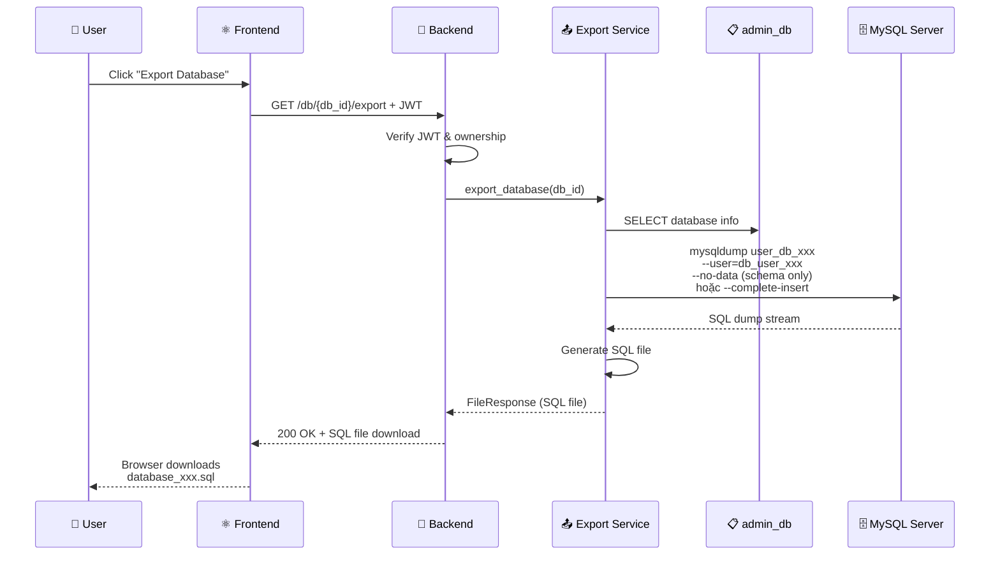
```mermaid
sequenceDiagram
    participant U as 👤 User
    participant FE as ⚛️ Frontend
    participant BE as 🐍 Backend
    participant ExportService as 📤 Export Service
    participant AdminDB as 📋 admin_db
    participant MySQL as 🗄️ MySQL Server

    U->>FE: Click "Export Database"
    FE->>BE: GET /db/{db_id}/export + JWT
    BE->>BE: Verify JWT & ownership
    BE->>ExportService: export_database(db_id)
    ExportService->>AdminDB: SELECT database info
    ExportService->>MySQL: mysqldump user_db_xxx<br/>--user=db_user_xxx<br/>--no-data (schema only)<br/>hoặc --complete-insert
    MySQL-->>ExportService: SQL dump stream
    ExportService->>ExportService: Generate SQL file
    ExportService-->>BE: FileResponse (SQL file)
    BE-->>FE: 200 OK + SQL file download
    FE-->>U: Browser downloads<br/>database_xxx.sql
```

### 9.2. Import Database

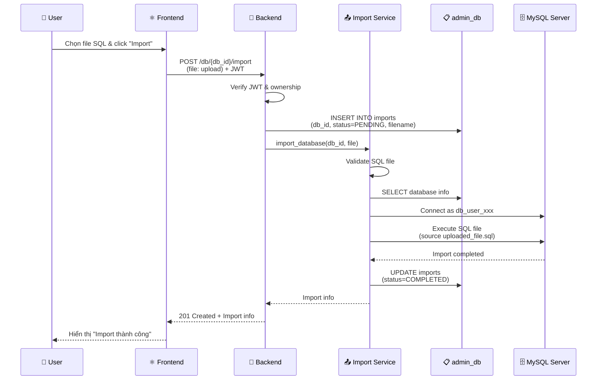
```mermaid
sequenceDiagram
    participant U as 👤 User
    participant FE as ⚛️ Frontend
    participant BE as 🐍 Backend
    participant ExportService as 📤 Import Service
    participant AdminDB as 📋 admin_db
    participant MySQL as 🗄️ MySQL Server

    U->>FE: Chọn file SQL & click "Import"
    FE->>BE: POST /db/{db_id}/import<br/>(file: upload) + JWT
    BE->>BE: Verify JWT & ownership
    BE->>AdminDB: INSERT INTO imports<br/>(db_id, status=PENDING, filename)
    BE->>ExportService: import_database(db_id, file)
    ExportService->>ExportService: Validate SQL file
    ExportService->>AdminDB: SELECT database info
    ExportService->>MySQL: Connect as db_user_xxx
    ExportService->>MySQL: Execute SQL file<br/>(source uploaded_file.sql)
    MySQL-->>ExportService: Import completed
    ExportService->>AdminDB: UPDATE imports<br/>(status=COMPLETED)
    ExportService-->>BE: Import info
    BE-->>FE: 201 Created + Import info
    FE-->>U: Hiển thị "Import thành công"
```

## 10. 🔄 Luồng Tổng Hợp - Quản Lý Database

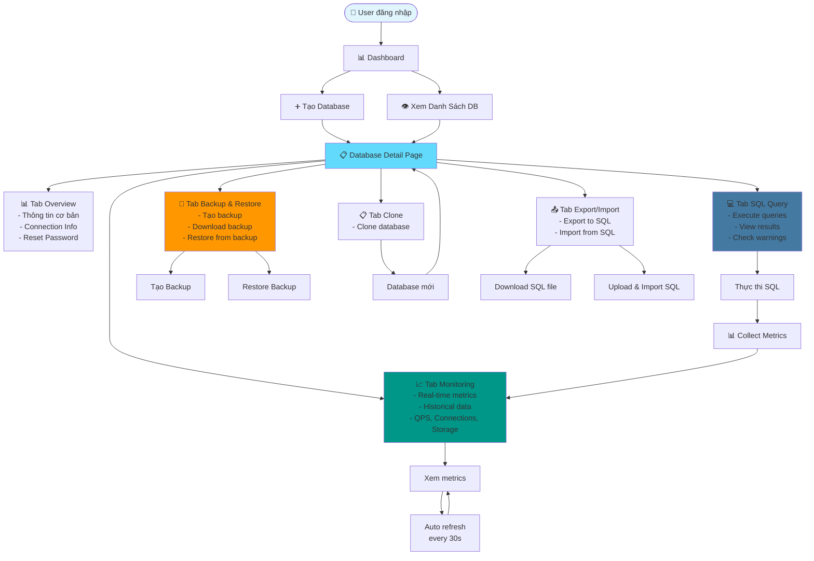
```mermaid
flowchart TD
    Start([👤 User đăng nhập]) --> Dashboard[📊 Dashboard]
    Dashboard --> CreateDB[➕ Tạo Database]
    Dashboard --> ViewDB[👁️ Xem Danh Sách DB]
    
    CreateDB --> DBDetail[📋 Database Detail Page]
    ViewDB --> DBDetail
    
    DBDetail --> Overview[📊 Tab Overview<br/>- Thông tin cơ bản<br/>- Connection Info<br/>- Reset Password]
    DBDetail --> SQL[💻 Tab SQL Query<br/>- Execute queries<br/>- View results<br/>- Check warnings]
    DBDetail --> Backup[💾 Tab Backup & Restore<br/>- Tạo backup<br/>- Download backup<br/>- Restore from backup]
    DBDetail --> Monitor[📈 Tab Monitoring<br/>- Real-time metrics<br/>- Historical data<br/>- QPS, Connections, Storage]
    DBDetail --> Clone[📋 Tab Clone<br/>- Clone database]
    DBDetail --> Export[📤 Tab Export/Import<br/>- Export to SQL<br/>- Import from SQL]
    
    SQL --> ExecuteSQL[Thực thi SQL]
    ExecuteSQL --> CollectMetrics[📊 Collect Metrics]
    CollectMetrics --> Monitor
    
    Backup --> CreateBackup[Tạo Backup]
    Backup --> RestoreBackup[Restore Backup]
    
    Clone --> NewDB[Database mới]
    NewDB --> DBDetail
    
    Export --> DownloadSQL[Download SQL file]
    Export --> UploadSQL[Upload & Import SQL]
    
    Monitor --> ViewMetrics[Xem metrics]
    ViewMetrics --> RefreshMetrics[Auto refresh<br/>every 30s]
    RefreshMetrics --> ViewMetrics
    
    style Start fill:#e1f5ff
    style DBDetail fill:#61dafb
    style Monitor fill:#009688
    style SQL fill:#4479a1
    style Backup fill:#ff9800
```

## 11. 📈 Data Flow - Thu Thập Metrics

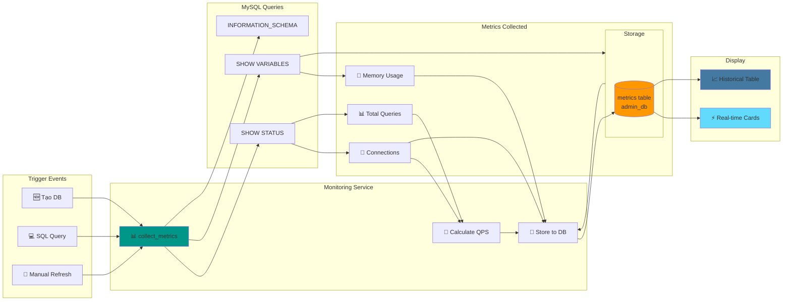
```mermaid
graph LR
    subgraph "Trigger Events"
        CreateDB[🆕 Tạo DB]
        SQLQuery[💻 SQL Query]
        ManualRefresh[🔄 Manual Refresh]
    end

    subgraph "Monitoring Service"
        Collect[📊 collect_metrics]
        CalcQPS[🧮 Calculate QPS]
        Store[💾 Store to DB]
    end

    subgraph "MySQL Queries"
        ShowStatus[SHOW STATUS]
        ShowVariables[SHOW VARIABLES]
        InfoSchema[INFORMATION_SCHEMA]
    end

    subgraph "Metrics Collected"
        Connections[🔌 Connections]
        Storage[💾 Storage MB]
        Queries[📊 Total Queries]
        Memory[🧠 Memory Usage]
    end

    subgraph "Storage"
        MetricsTable[(metrics table<br/>admin_db)]
    end

    subgraph "Display"
        RealTime[⚡ Real-time Cards]
        Historical[📈 Historical Table]
    end

    CreateDB --> Collect
    SQLQuery --> Collect
    ManualRefresh --> Collect
    
    Collect --> ShowStatus
    Collect --> ShowVariables
    Collect --> InfoSchema
    
    ShowStatus --> Connections
    ShowStatus --> Queries
    ShowVariables --> Storage
    ShowVariables --> Memory
    
    Connections --> CalcQPS
    Queries --> CalcQPS
    
    CalcQPS --> Store
    Connections --> Store
    Storage --> Store
    Memory --> Store
    
    Store --> MetricsTable
    
    MetricsTable --> RealTime
    MetricsTable --> Historical
    
    style Collect fill:#009688
    style MetricsTable fill:#ff9800
    style RealTime fill:#61dafb
    style Historical fill:#4479a1
```

## 12. 🔒 Security Flow - Authentication & Authorization

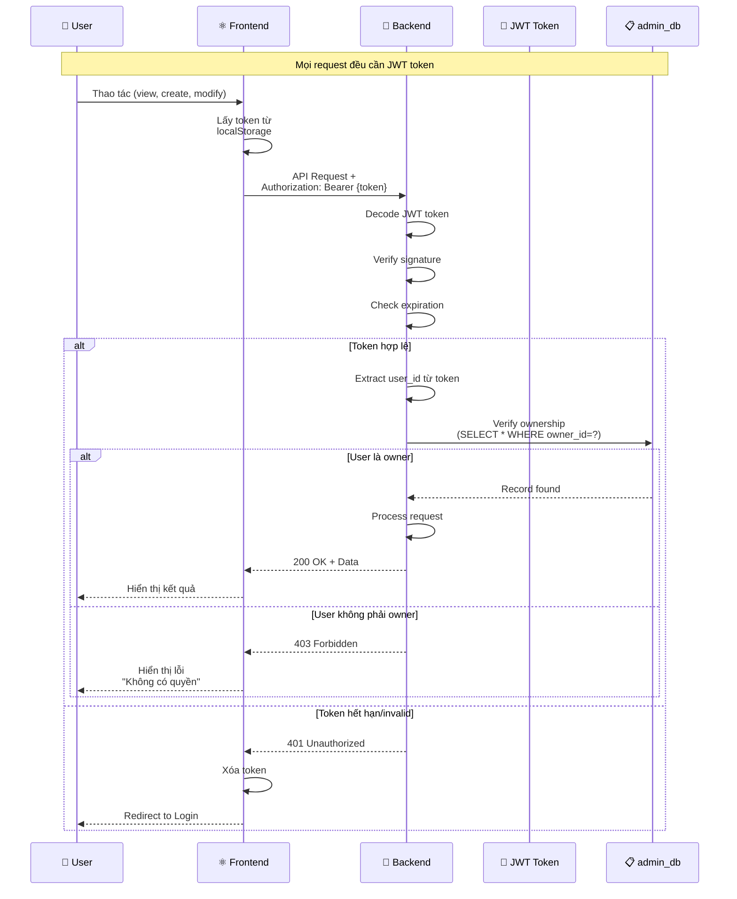
```mermaid
sequenceDiagram
    participant U as 👤 User
    participant FE as ⚛️ Frontend
    participant BE as 🐍 Backend
    participant JWT as 🔑 JWT Token
    participant AdminDB as 📋 admin_db

    Note over U,AdminDB: Mọi request đều cần JWT token

    U->>FE: Thao tác (view, create, modify)
    FE->>FE: Lấy token từ<br/>localStorage
    FE->>BE: API Request +<br/>Authorization: Bearer {token}
    BE->>BE: Decode JWT token
    BE->>BE: Verify signature
    BE->>BE: Check expiration
    
    alt Token hợp lệ
        BE->>BE: Extract user_id từ token
        BE->>AdminDB: Verify ownership<br/>(SELECT * WHERE owner_id=?)
        alt User là owner
            AdminDB-->>BE: Record found
            BE->>BE: Process request
            BE-->>FE: 200 OK + Data
            FE-->>U: Hiển thị kết quả
        else User không phải owner
            BE-->>FE: 403 Forbidden
            FE-->>U: Hiển thị lỗi<br/>"Không có quyền"
        end
    else Token hết hạn/invalid
        BE-->>FE: 401 Unauthorized
        FE->>FE: Xóa token
        FE-->>U: Redirect to Login
    end
```

## 13. 🗄️ Database Architecture

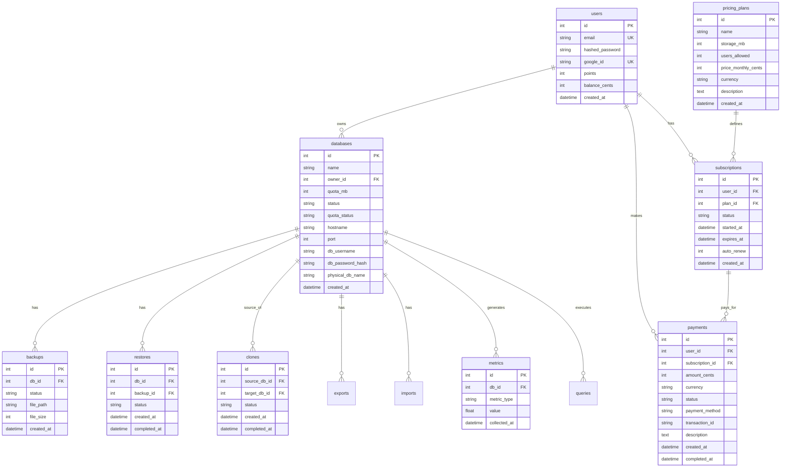
```mermaid
erDiagram
    users ||--o{ databases : owns
    users ||--o{ subscriptions : has
    users ||--o{ payments : makes
    databases ||--o{ backups : has
    databases ||--o{ restores : has
    databases ||--o{ clones : source_of
    databases ||--o{ exports : has
    databases ||--o{ imports : has
    databases ||--o{ metrics : generates
    databases ||--o{ queries : executes
    subscriptions ||--o{ payments : pays_for
    pricing_plans ||--o{ subscriptions : defines

    users {
        int id PK
        string email UK
        string hashed_password
        string google_id UK
        int points
        int balance_cents
        datetime created_at
    }

    databases {
        int id PK
        string name
        int owner_id FK
        int quota_mb
        string status
        string quota_status
        string hostname
        int port
        string db_username
        string db_password_hash
        string physical_db_name
        datetime created_at
    }

    pricing_plans {
        int id PK
        string name
        int storage_mb
        int users_allowed
        int price_monthly_cents
        string currency
        text description
        datetime created_at
    }

    subscriptions {
        int id PK
        int user_id FK
        int plan_id FK
        string status
        datetime started_at
        datetime expires_at
        int auto_renew
        datetime created_at
    }

    payments {
        int id PK
        int user_id FK
        int subscription_id FK
        int amount_cents
        string currency
        string status
        string payment_method
        string transaction_id
        text description
        datetime created_at
        datetime completed_at
    }

    backups {
        int id PK
        int db_id FK
        string status
        string file_path
        int file_size
        datetime created_at
    }

    restores {
        int id PK
        int db_id FK
        int backup_id FK
        string status
        datetime created_at
        datetime completed_at
    }

    clones {
        int id PK
        int source_db_id FK
        int target_db_id FK
        string status
        datetime created_at
        datetime completed_at
    }

    metrics {
        int id PK
        int db_id FK
        string metric_type
        float value
        datetime collected_at
    }
```

---

## 📝 Ghi Chú

1. **Kiến trúc**: Hệ thống sử dụng microservices pattern với các services tách biệt (Backup, Monitoring, Clone, Export/Import, SQL Executor)

2. **Security**: 
   - Mỗi database có user riêng với quyền hạn chế (không phải root)
   - JWT token cho authentication
   - Ownership verification cho mọi operation

3. **Monitoring**: 
   - Metrics được collect tự động sau mỗi SQL query và khi tạo DB
   - QPS được tính dựa trên delta của total queries
   - Historical data lưu trong admin_db.metrics table

4. **Backup/Restore**: 
   - Sử dụng mysqldump để tạo backup
   - File lưu trong Docker volumes
   - Support download và restore

5. **Scalability**: 
   - Docker containerization cho dễ scale
   - Nginx reverse proxy cho load balancing (tương lai)
   - Mỗi user database độc lập

